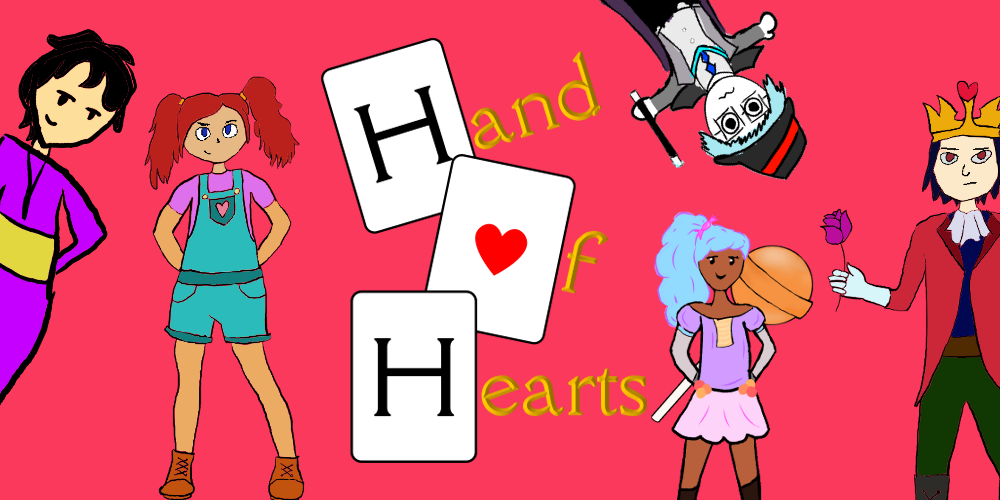

# Hand of Hearts

  

## About

Hand of Hearts is a dating simulator that blends a visual novel with a turn-based card game, where sweet-talking your opponent will let you obtain more powerful cards for future fights on your quest to defeat the tyrannical ruler of the land.

This project was developed by Alysha Kim, Jessica Li, and Brandon Ye as a part of CISC 226 - Game Design at Queen's University during winter 2021. The game was built with Unity and C#.

## Demo

https://creative.caslab.queensu.ca/~hand-of-hearts/
